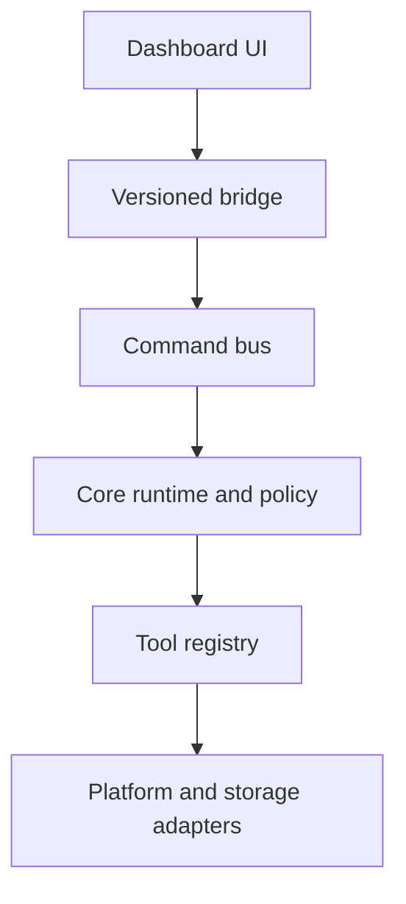
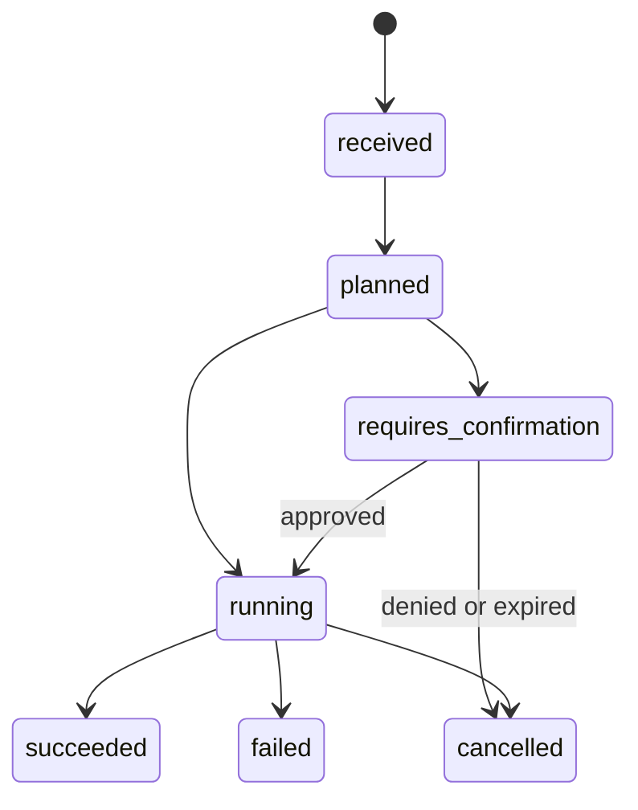
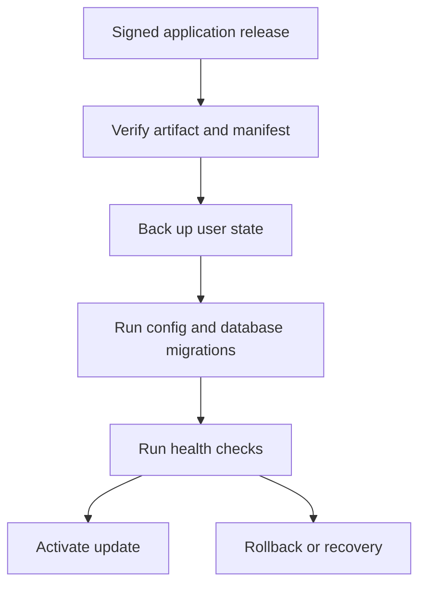

# CerebralHelm MVP Product Requirements Document

# Document Control

**Status:** Approved implementation baseline for MVP planning  
**Product owner:** Nick Southey  
**Product:** CerebralHelm  
**Assistant identity:** Heimlich  
**Target:** Pre-Mac Foundation v0.1 followed by macOS MVP v1.0  
**Primary user:** A single technical owner using CerebralHelm as a daily personal command environment  

This PRD replaces the source documents as the implementation-level definition of the MVP. The updated North Star remains authoritative for long-term intent. The current Design Doc remains authoritative for visual grammar. This PRD is authoritative for MVP scope, requirements, acceptance, and release gates.

When sources disagree, use this precedence:

1. Latest explicit product decisions in this PRD.
2. This PRD's requirement and acceptance language.
3. Current Design Doc for layout and interaction grammar.
4. Build Plan for durable architectural intent.
5. Updated North Star for long-term capability boundaries.

## Current Product Vocabulary

| Concept | MVP decision |
|---|---|
| Modes | Executive, Developer, School, Entertainment |
| Configured agent surfaces | Research Analyst, Financial Advisor, Project Manager, System Janitor |
| Assistant | Heimlich |
| Voice policy | Push-to-talk later; no always-listening MVP behavior |
| System metrics | CPU, memory, and network throughput; battery and display status when practical on macOS |
| Bottom bar | Persistent and materially thinner than the early mockups, targeting about 60 percent of the earlier visual height |
| Confirmation color | Neutral system blue in every mode |
| Knowledge truth | Markdown plus SQLite; any future vector index is disposable |

# 1. Executive Summary

CerebralHelm is a local-first personal command layer that runs on top of macOS. It is not a replacement operating system and it is not a chatbot wrapped around broad system permissions. It is a persistent dashboard, command surface, mode engine, knowledge capture system, and narrow tool runtime designed to reduce context switching while keeping actions legible and controllable.

The MVP proves one product claim:

> CerebralHelm can be the reliable front door to a normal day on a Mac before it becomes a general-purpose agent.

The MVP starts on the current non-Mac computer and ends as a daily-usable macOS application. The Pre-Mac release contains the production dashboard, command contracts, deterministic core, mode planning, knowledge capture, risk policy, operational database, mock adapters, fixtures, and regression suite. The Mac phase adds a native shell, platform adapters, global access, system metrics, packaging, and an update path that preserves user state.

The MVP intentionally does not include a production LLM router, real specialized agents, voice input, Google Workspace automation, semantic RAG, an iOS companion, continuous screen or camera perception, booking, finance connections, or autonomous external writes. It defines stable boundaries for those capabilities so they can be added without bypassing the command bus, policy engine, tool registry, or durable data model.

# 2. Product Context

## 2.1 Problem

The user moves repeatedly between software development, school, planning, personal administration, and entertainment. The useful context for each activity is scattered across applications, browser tabs, notes, repositories, files, and memory. Even simple transitions require repeated manual steps: open the right applications, navigate to the right URLs, recover the active project, find notes, and reconstruct what mattered.

Existing launchers and automation products can open things, and general AI assistants can reason about text, but neither category by itself provides the intended combination:

- a persistent visual home base;
- config-driven life and work modes;
- a single command lifecycle for clicks, text, future voice, and future mobile input;
- inspectable local knowledge;
- explicit tool boundaries and risk policy;
- platform-specific control hidden behind replaceable adapters;
- a foundation for local and cloud models without binding the product to either.

## 2.2 North Star Alignment

The North Star describes a command center on the Mac, a lightweight iOS companion, Heimlich as the interaction personality, narrow tools as capability, and a hybrid knowledge system as memory. The MVP builds the Mac command center's non-agentic spine first.

Every MVP choice must preserve the following future truths:

- Typed, clicked, voice, mobile, automation, and agent commands converge on one command bus.
- UI components express intent and subscribe to state; they do not directly control the platform.
- Agents receive scoped tools and scoped knowledge rather than universal access.
- Models are replaceable consumers of contracts, not owners of business logic.
- External services sit behind provider-neutral interfaces.
- Sensitive context has an explicit local or cloud policy.
- Screen and attention context, if later added, is bounded, visible, opt-in, and short-lived.

## 2.3 Primary User

The MVP is optimized for one technical owner. Multi-user collaboration, enterprise administration, generalized distribution, and public plugin ecosystems are not MVP requirements. The architecture must not make them impossible, but it should not pay their complexity cost yet.

## 2.4 Jobs To Be Done

1. When I start or switch work, reconfigure my digital workspace with one action.
2. When I know what I want, execute it through one consistent command surface.
3. When an idea occurs, capture it immediately into durable, readable knowledge.
4. When I return to a project, surface the current context and recent activity.
5. When CerebralHelm acts, show what happened, what failed, and what requires approval.
6. When the application updates, preserve my knowledge, preferences, configuration, and history.

# 3. Goals, Non-Goals, and Success

## 3.1 MVP Goals

| ID | Goal |
|---|---|
| G-01 | Provide a globally reachable macOS command palette and persistent dashboard. |
| G-02 | Execute a small set of deterministic, narrow tools through one registry and lifecycle. |
| G-03 | Apply four config-defined modes that change workspace intent, dashboard state, and planned actions. |
| G-04 | Capture and search local Markdown knowledge while recording structured operational metadata in SQLite. |
| G-05 | Enforce deterministic risk and confirmation policy outside any model. |
| G-06 | Make command, tool, confirmation, mode, and error activity visible and testable. |
| G-07 | Separate native, provider, model, and UI concerns through versioned contracts and adapters. |
| G-08 | Ship repeatable CI, packaging, migrations, backup, and update behavior that preserves user state. |
| G-09 | Deliver a polished dashboard faithful to the current visual direction and usable at laptop and external-display sizes. |

## 3.2 Explicit Non-Goals

The MVP does not include:

- production agent orchestration or autonomous multi-step planning;
- a live local or cloud LLM dependency for core workflows;
- real Research Analyst, Financial Advisor, Project Manager, or System Janitor reasoning;
- voice transcription, text-to-speech, wake word, or always-listening behavior;
- Google Workspace, Canvas, GitHub, Linear, banking, or booking integrations beyond launch shortcuts and mock data;
- embeddings, vector search, automatic memory extraction, or background indexing of personal content;
- an iOS application or remote command bridge;
- fullscreen edge sidebar, universal overlay, Stage Manager automation, or deep fullscreen control;
- continuous screen capture, OCR, camera access, eye tracking, or attention scoring;
- sending messages or email, making purchases, deleting important files, or pushing code;
- broad shell access;
- public distribution, accounts, multi-user sync, or a third-party plugin marketplace.

## 3.3 Product Success Criteria

The MVP is successful when the user can complete the following on the target Mac for a normal day without editing source code:

1. Launch CerebralHelm at login or manually and use the dashboard offline.
2. Open the command palette with a global hotkey.
3. Open configured applications and URLs through CerebralHelm.
4. switch among Executive, Developer, School, and Entertainment modes.
5. Capture a note into the knowledge hierarchy and find it again.
6. Run an allowlisted local hook only after the policy-prescribed confirmation.
7. See command lifecycle, tool activity, confirmation decisions, recent notes, and errors.
8. Change supported mode, shortcut, appearance, and tool configuration without rebuilding.
9. Install an application update without resetting user configuration, knowledge, preferences, or history.
10. Recover cleanly when an application is missing, a hook fails, SQLite is locked, or system metrics are unavailable.

## 3.4 Quantitative Release Targets

| Measure | MVP target |
|---|---|
| Dashboard local launch | First usable paint within 2.5 seconds on the target Mac after warm installation |
| Command palette open | Visible and focused within 200 ms of hotkey under normal load |
| Deterministic command feedback | Lifecycle acknowledgement within 100 ms; terminal result target under 1 second excluding external process duration |
| Note capture | Durable file write and visible success under 500 ms for normal local storage |
| Mode planning | Planned action list produced under 250 ms before native actions begin |
| Offline core workflows | 100 percent of launch, mode planning, note capture/search, settings, and history functions available without network |
| Regression quality | All required unit, contract, migration, browser, and macOS smoke tests pass for release |
| Update preservation | Zero loss or silent reset of knowledge, config overrides, preferences, secrets, or history in the supported update matrix |

# 4. Product Principles

## 4.1 Useful Before Intelligent

The core daily workflows must remain available without a model or network connection. Natural-language interpretation may later augment direct commands, but deterministic commands and visible quick actions are the MVP product.

## 4.2 Local-First, Not Local-Only

Durable personal state stays local and inspectable. Future cloud calls receive only an allowed, task-specific context slice. The MVP implements the policy fields and logging shape without requiring a cloud provider.

## 4.3 Contracts Before Providers

Commands, tools, modes, events, storage, UI bridge messages, and future model requests have stable versioned schemas. AppKit, a model SDK, a database extension, or an external API is an implementation behind those contracts.

## 4.4 Policy Outside Models

A model may propose an action. It cannot assign a lower risk class, bypass confirmation, read a secret, or directly invoke a platform capability. The policy engine evaluates declared tool metadata and runtime context deterministically.

## 4.5 Inspectable and Reversible

The UI should make the command state, planned action, destination, adapter, and result understandable. Local writes should be atomic. Updates and migrations should be backed up and recoverable. Destructive capability is deferred.

## 4.6 Graceful Degradation

One broken integration must not disable the command surface. Missing metrics show unavailable states. Missing applications return structured errors. A damaged disposable index can be rebuilt. A native adapter failure must not corrupt the operational log or dashboard state.

# 5. Release Boundary and Phases

## 5.1 Pre-Mac Foundation v0.1

Pre-Mac v0.1 is production foundation, not a throwaway prototype. It runs on the current computer with mock native adapters and includes:

- repository, bootstrap, and development command surface;
- architecture decision records and versioned schemas;
- command bus, lifecycle, direct command parser, registry, policy, and executor;
- deterministic mock tools and structured failures;
- configuration loader, four modes, and mode action planner;
- Markdown knowledge hierarchy, capture, basic search, and SQLite migrations;
- production React dashboard using a mock bridge;
- confirmation, settings, Heimlich state, configured agent surface, and error states;
- CI, browser regression tests, contract tests, migration tests, secret scanning, and compatibility documentation;
- application/user-data separation and update manifest design.

No production component in this release may import AppKit or rely on a real external provider.

## 5.2 macOS MVP v1.0

The Mac phase adds only the capabilities that require honest platform implementation and validation:

- native application target and AppKit lifecycle;
- WKWebView dashboard host and versioned native bridge;
- menu bar item and global command hotkey;
- dashboard/backdrop, persistent bottom bar, settings, and confirmation window behavior;
- NSWorkspace app and URL tools;
- allowlisted process/hook execution;
- live CPU, memory, network, battery, and display providers where stable;
- Keychain-backed secret references;
- accessibility permission onboarding and basic normal-window layout support if reliable;
- login item;
- signing, notarization, packaging, update channels, migrations, backup, health check, and recovery;
- end-to-end acceptance and compatibility checks on the target Mac.

## 5.3 Future Pools Outside MVP

Post-MVP work is organized around orchestration, RAG and freshness, Google Workspace, voice, iOS, deeper window management, fullscreen access, specialized agents, perception, web automation, and finance. These pools must reuse MVP contracts rather than create parallel paths.

# 6. System Architecture



## 6.1 Layer Responsibilities

| Layer | Owns | Must not own |
|---|---|---|
| Dashboard UI | Presentation, user intent, local view state, accessible controls, event rendering | Filesystem, processes, native APIs, provider APIs, secrets, policy decisions |
| Native shell | Windows, hotkeys, lifecycle, bridge transport, permissions, platform event sources | Product policy, provider-specific workflows, knowledge semantics |
| Command bus | Envelope, identity, source, ordering, lifecycle, cancellation, event publication | Tool implementation, UI rendering, platform code |
| Core runtime | Direct parsing, mode planning, policy coordination, execution orchestration | Native APIs, provider SDK assumptions, unscoped model logic |
| Tool registry | Descriptors, schemas, risk, permission metadata, timeout, handler binding | UI state, hardcoded secrets, model selection |
| Adapters | Platform, storage, or provider-specific behavior | Cross-product policy and presentation |
| Knowledge | Note metadata, durable capture, search, freshness fields, source references | Model prompts, UI layout, vector authority |
| Operational data | Commands, events, tool calls, confirmations, sessions, migrations | Long-form personal knowledge |
| Update system | Artifact verification, backup, migration, health check, recovery | Destructive replacement of user state |

## 6.2 Target Repository Shape

```text
CerebralHelm/
  .agent/
    spec/               # Canonical implementation specifications
  apps/
    dashboard/          # React + TypeScript production UI
    mac/                # AppKit host, initially a documented placeholder
    ios/                # Future placeholder only
  packages/
    core/               # Portable command, policy, and mode logic
    tools/              # Tool contracts and portable handlers
    knowledge/          # Capture, metadata, search, repositories
    contracts/          # JSON Schemas and generated types
    shared/             # Cross-package primitives only
  config/
    defaults/
    modes/
    agents/
    tools/
  database/migrations/
  fixtures/
  knowledge-template/
  docs/
    adr/
    architecture/
    compatibility/
    operations/
  scripts/
  wiki/                 # Human-readable product and architecture reference
```

This is a conceptual boundary, not a mandate for unnecessary packages. The implementation may adjust directories while preserving ownership.

## 6.3 Command Envelope

Every user or system intent becomes a versioned command envelope.

```json
{
  "schemaVersion": "1.0",
  "id": "cmd_01J...",
  "type": "command.submit",
  "source": "dashboard",
  "rawInput": "mode developer",
  "timestamp": "2026-06-23T16:00:00Z",
  "correlationId": null,
  "payload": {},
  "privacy": {
    "sensitivity": "private",
    "cloudPolicy": "deny"
  }
}
```

Supported MVP sources are `dashboard`, `hotkey`, `cli`, `automation`, and `system`. `voice`, `ios`, and `agent` are reserved values with fixtures but no production producer.

## 6.4 Command Lifecycle



Each transition emits an immutable event containing command ID, event ID, timestamp, previous status, current status, optional user message, and an optional structured error. A denied confirmation ends as `cancelled`, not `failed`. Invalid transitions are rejected and logged.

## 6.5 Tool Contract

Every tool descriptor includes:

- stable, provider-neutral name and semantic version;
- human-readable purpose;
- versioned input and output JSON Schemas;
- risk class and confirmation policy key;
- required platform permissions and secret references;
- timeout, retry, idempotency, and cancellation behavior;
- adapter capability requirements;
- logging fields and redaction rules;
- dry-run or rollback metadata when meaningful;
- structured success, partial success, unavailable, timeout, denied, and failure results.

The MVP tool namespace is:

| Tool | MVP behavior | Default risk |
|---|---|---|
| `app.open` | Open a configured application reference | `local_write` |
| `url.open` | Open an allowlisted URL reference | `local_write` |
| `hook.run` | Execute a configured allowlisted hook | `shell` |
| `note.capture` | Atomically write a Markdown note | `local_write` |
| `note.search` | Search filenames, metadata, and content | `read_only` |
| `mode.apply` | Plan and execute configured mode actions | Highest risk of planned actions |
| `system.status.read` | Return supported metrics and availability | `read_only` |

Names are semantic and do not reveal NSWorkspace, shell, browser, or storage implementation.

## 6.6 Bridge Contract

The dashboard communicates through a `CerebralBridge` interface. Pre-Mac uses `MockCerebralBridge`; macOS uses a WKWebView transport. React components must not branch on transport.

Required operations:

```typescript
interface CerebralBridge {
  getBootstrapState(): Promise<BootstrapState>;
  submitCommand(input: CommandDraft): Promise<CommandReceipt>;
  applyMode(modeId: string): Promise<CommandReceipt>;
  captureNote(draft: NoteDraft): Promise<CommandReceipt>;
  searchNotes(query: NoteQuery): Promise<NoteSearchResult>;
  decideConfirmation(id: string, decision: ConfirmationDecision): Promise<void>;
  updateSettings(patch: SettingsPatch): Promise<SettingsResult>;
  subscribe(listener: (event: CerebralEvent) => void): Unsubscribe;
}
```

Handshake messages include bridge version, UI version, core version, supported capabilities, and degraded features. Incompatible major versions show a recovery screen rather than silently continuing.

# 7. Functional Requirements

## 7.1 Application Shell and Bootstrap

| ID | Requirement | Acceptance |
|---|---|---|
| FR-SHL-01 | The macOS app shall launch manually and optionally at login. | Manual launch works offline; login launch can be enabled or disabled without reinstalling. |
| FR-SHL-02 | The app shall expose a menu bar item and configurable global command hotkey. | Hotkey opens and focuses one command palette instance; conflicts produce a clear settings error. |
| FR-SHL-03 | The app shall host the production dashboard without a network dependency. | Bundled UI loads from local assets and receives bootstrap state through the bridge. |
| FR-SHL-04 | Native windows shall have explicit roles: dashboard, bottom bar, command palette, confirmation, and settings. | Each role has one owner, deterministic show/hide behavior, and no duplicate orphan windows. |
| FR-SHL-05 | Startup shall validate data paths, schema versions, migrations, and bridge compatibility before accepting writes. | Failure enters a read-only recovery view with diagnostics and does not mutate user data. |
| FR-SHL-06 | Native-only capabilities shall be reported through capability flags. | Unsupported or denied features render unavailable states without blocking portable workflows. |

## 7.2 Dashboard and Navigation

| ID | Requirement | Acceptance |
|---|---|---|
| FR-UI-01 | The dashboard shall implement Executive, Developer, School, and Entertainment presentations from shared layout grammar and mode tokens. | Mode changes alter theme, briefing, quick actions, apps, and project context without remounting the application shell. The displayed agent roster is a fixed global set shown identically in every mode and does not change when the mode changes. |
| FR-UI-02 | The main layout shall use a dense left information zone, calm center Heimlich/action zone, and right mode/app/agent/context zone. | Required content remains readable at target laptop and external-display viewports. |
| FR-UI-03 | The command center shall expose note, task placeholder, idea, command/voice placeholder, knowledge, projects, inbox, files, calendar, and downloads actions according to mode config. | MVP-available actions execute; future actions are visibly disabled or marked unavailable, never simulated as successful. |
| FR-UI-04 | The persistent bottom bar shall expose Heimlich state, active mode, active project/context, compact status, time, settings, and emergency return/close controls. | Bar remains thin, keyboard accessible, and does not cover dashboard content. |
| FR-UI-05 | The right region shall show the four configured agent surfaces without an add button. | Selecting an agent opens a mock workspace with Chat, Context, History, suggested actions, linked knowledge, status, and input disabled as appropriate. |
| FR-UI-06 | Settings shall appear as a floating window, not replace the dashboard. | Sections include General, Modes, Agents, Tools, Hotkeys, Knowledge, Models, Permissions, Logs, Appearance, and Startup. |
| FR-UI-07 | The UI shall provide first-class loading, empty, stale, unavailable, offline, error, confirmation, success, and cancelled states. | Fixture-driven stories and visual tests cover each state. |
| FR-UI-08 | Heimlich shall expose idle, listening-placeholder, thinking, acting, confirmation, success, error, and offline states. | State changes are event-driven and do not imply unavailable voice capability. |
| FR-UI-09 | The UI shall meet keyboard, focus, contrast, reduced-motion, and screen-reader labeling requirements for MVP workflows. | Automated checks pass and manual keyboard navigation completes all acceptance flows. |

## 7.3 Command Palette and Command Bus

| ID | Requirement | Acceptance |
|---|---|---|
| FR-CMD-01 | All commands shall receive globally unique IDs and enter through the same bus. | Dashboard, hotkey, and CLI commands produce equivalent envelopes and event sequences. |
| FR-CMD-02 | The MVP parser shall support deterministic grammar for app, URL, mode, note, search, and hook commands. | Supported commands resolve without a model; unknown input returns suggestions without executing. |
| FR-CMD-03 | The bus shall enforce valid lifecycle transitions and terminal-state immutability. | Invalid transitions fail tests and create an internal diagnostic event. |
| FR-CMD-04 | The bus shall support cancellation before and during cancellable execution. | Cancelled work ends as `cancelled`, stops the adapter when supported, and never reports success. |
| FR-CMD-05 | Commands shall expose concise progress and structured terminal results. | UI and CLI render the same semantic result without parsing log strings. |
| FR-CMD-06 | Command history shall be queryable and bounded in the dashboard. | Recent history loads incrementally and sensitive arguments are redacted. |

## 7.4 Tool Registry and Execution

| ID | Requirement | Acceptance |
|---|---|---|
| FR-TOL-01 | Tools shall register only through validated descriptors and handlers. | Duplicate names, incompatible schemas, or missing policy metadata fail startup validation. |
| FR-TOL-02 | Tool inputs and outputs shall validate at the registry boundary. | Invalid input never reaches an adapter; invalid output becomes a structured adapter-contract failure. |
| FR-TOL-03 | The executor shall apply policy before invocation and timeout/cancellation around invocation. | Tests prove denied calls never execute and timed-out calls emit one terminal result. |
| FR-TOL-04 | Mock and native handlers shall satisfy the same contract suite. | Contract tests can run against every adapter implementation. |
| FR-TOL-05 | Hooks shall be referenced by config ID, not arbitrary command text. | Unregistered commands cannot execute; the confirmation preview shows executable, arguments, working directory, and reversibility. |
| FR-TOL-06 | Tool errors shall use stable categories. | UI can distinguish invalid input, unavailable capability, permission denied, timeout, cancelled, provider failure, and internal failure. |

## 7.5 Modes and Active Context

| ID | Requirement | Acceptance |
|---|---|---|
| FR-MOD-01 | Modes shall be defined in validated configuration rather than hardcoded UI branches. | Adding or changing supported configuration updates labels, theme tokens, widgets, actions, apps, agents, and project hints without rebuilding core logic. |
| FR-MOD-02 | Mode application shall create a deterministic ordered action plan before execution. | Preview and tests show the same plan for the same config and environment capabilities. |
| FR-MOD-03 | Mode risk shall be at least the highest risk of its planned actions. | A mode containing a hook cannot bypass hook confirmation. |
| FR-MOD-04 | Mode application shall support partial success. | Missing apps or unavailable metrics are reported per action; successful actions and active UI context remain coherent. |
| FR-MOD-05 | Active mode and project/context shall be persisted separately. | Restart restores the last valid mode and context, or safe defaults if references are missing. |
| FR-MOD-06 | Mode history shall be recorded as sessions. | Activation, end time, source, project/context, result, and version are queryable. |

> A quick action is a workflow resolved by the same planner; FR-MOD-02 (deterministic ordered plan) and FR-MOD-03 (aggregate risk ≥ highest step) apply identically to a single quick action (N=1) and a mode application.

## 7.6 Knowledge Capture and Search

| ID | Requirement | Acceptance |
|---|---|---|
| FR-KNW-01 | Markdown files shall be the human-readable source of truth for notes and project context. | Notes remain readable and editable outside CerebralHelm. |
| FR-KNW-02 | Capture shall use stable IDs, minimal frontmatter, safe filenames, and atomic writes. | Interrupted writes do not leave a success event or corrupt an existing note. |
| FR-KNW-03 | The default hierarchy shall separate inbox, daily, projects, areas, reference, and archive. | Modes reference durable folders; they do not duplicate knowledge by mode. |
| FR-KNW-04 | Basic search shall cover filename, title, metadata, and content without embeddings. | Newly captured notes are findable and results cite their source path. |
| FR-KNW-05 | Knowledge records shall carry sensitivity, cloud policy, created, updated, status, and optional review-after metadata. | Missing optional metadata degrades to safe defaults; cloud policy defaults to deny or ask, never allow. |
| FR-KNW-06 | Search/index metadata shall be rebuildable from files. | Deleting the search index and rebuilding preserves note truth and produces equivalent searchable records. |
| FR-KNW-07 | The user shall be able to choose the knowledge root and validate permissions. | Read-only or missing roots produce recovery guidance and no false success. |

## 7.7 Operational Data and Observability

| ID | Requirement | Acceptance |
|---|---|---|
| FR-OBS-01 | SQLite shall store schema migrations, commands, command events, tool calls, confirmations, note metadata, mode sessions, settings metadata, and update history. | A clean database can apply every forward migration in order. |
| FR-OBS-02 | Operational writes shall use clear transaction boundaries and foreign-key integrity. | Failure cannot leave a succeeded command without its terminal event or referenced tool call. |
| FR-OBS-03 | Logs shall be structured and redact secrets and sensitive arguments by descriptor policy. | Secret canary tests prove credentials do not appear in database, files, console logs, fixtures, or crash diagnostics. |
| FR-OBS-04 | The dashboard shall expose recent commands, tool activity, confirmations, mode sessions, and structured errors. | The user can answer what ran, why it asked, what adapter was used, and what failed. |
| FR-OBS-05 | Retention shall be configurable with safe defaults. | Pruning old operational records does not delete Markdown knowledge or required migration/update history. |
| FR-OBS-06 | Future model and retrieval events shall have reserved, versioned event shapes. | No model provider is required, but fixtures validate model, cost, context-source, and cloud-policy fields. |

## 7.8 Configuration and Settings

| ID | Requirement | Acceptance |
|---|---|---|
| FR-CFG-01 | Configuration shall layer immutable defaults, versioned schema, user overrides, and environment-specific secret references. | An update may change defaults without overwriting valid user overrides. |
| FR-CFG-02 | Config files shall validate before activation and report file, field, expected type, and remediation. | Invalid changes leave the last known good configuration active. |
| FR-CFG-03 | Secrets shall be referenced by logical name and never stored in ordinary config. | Config export contains references only; macOS values resolve through Keychain. |
| FR-CFG-04 | Settings UI shall edit only supported schema fields and use the same validation path as manual edits. | UI and file edits produce equivalent validated configuration. |
| FR-CFG-05 | Configuration shall include a version and deterministic migrations. | Older supported config upgrades without losing unrelated or unknown user fields where safe. |
| FR-CFG-06 | Development, test, staging, and personal production state shall use separate roots. | Tests cannot open or mutate the personal knowledge base or production SQLite file. |

## 7.9 Safety and Confirmation

| ID | Requirement | Acceptance |
|---|---|---|
| FR-SAF-01 | Risk classes shall be `read_only`, `local_write`, `external_write`, `destructive`, `shell`, `financial`, and `purchase_or_booking`. | Every registered tool has exactly one declared class and optional stricter runtime policy. |
| FR-SAF-02 | Policy shall determine confirmation without model discretion. | A caller cannot supply `requiresConfirmation=false` to override descriptor policy. |
| FR-SAF-03 | Shell always requires confirmation unless both tool and exact invocation are explicitly allowlisted by user configuration. | Variations in executable, arguments, or working directory invalidate the allowlist match. |
| FR-SAF-04 | Confirmation shall disclose action, tool, destination, arguments, data leaving device, account/service, reversibility, and policy reason. | Approve, review, and cancel are distinct, keyboard accessible choices. |
| FR-SAF-05 | Confirmation tokens shall be single-use, command-bound, expiring, and invalid after plan changes. | Replay, mutation, or expiration prevents execution and produces a diagnostic event. |
| FR-SAF-06 | External content shall be treated as data, not trusted instructions. | Reserved future fixtures show prompt-injection text cannot change policy or invoke tools. |
| FR-SAF-07 | Denied platform permissions shall produce a capability error and guidance, not repeated prompts or bypass attempts. | The app remains usable for unrelated workflows. |

## 7.10 Packaging, Updates, and Recovery



| ID | Requirement | Acceptance |
|---|---|---|
| FR-UPD-01 | Application artifacts, bundled defaults, and user state shall live in separate locations. | Replacing the app bundle cannot overwrite knowledge, user overrides, SQLite, or secrets. |
| FR-UPD-02 | Releases shall be signed, notarized, versioned, and published with a verifiable manifest. | The updater rejects modified artifacts and incompatible platform or schema requirements. |
| FR-UPD-03 | Update channels shall support at least stable and beta without mixing user state. | Channel changes are explicit; the current version and channel are visible. |
| FR-UPD-04 | Before state migrations, the updater shall create and verify a timestamped backup. | A failed backup blocks migration and leaves the current version runnable. |
| FR-UPD-05 | Database and config migrations shall be forward, versioned, idempotent where practical, and covered by fixtures. | Supported old-state fixtures reach the expected new state exactly once. |
| FR-UPD-06 | Post-update health checks shall validate launch, bridge handshake, config, database, and core deterministic workflows. | Failure offers rollback or recovery and records the failure without deleting user changes. |
| FR-UPD-07 | Disposable derived data shall be rebuildable after updates. | Search indexes and caches can be recreated from durable sources. |
| FR-UPD-08 | Release automation shall not become the only way to install a development build. | Documented local build and manual recovery paths remain available. |

# 8. Core User Flows

## 8.1 First Launch and Bootstrap

**Trigger:** The user launches the installed app.

1. Native shell establishes application and user-data paths.
2. Bootstrap validates bridge versions, config schemas, knowledge root, and database state.
3. Pending migrations are previewed; required backups run before state changes.
4. The dashboard loads bundled assets and receives a capability-aware bootstrap state.
5. The app shows the default or last valid mode, recent activity, note summaries, and metric availability.
6. Missing optional capabilities appear as unavailable rather than blocking launch.
7. A fatal state validation failure opens recovery mode with read-only diagnostics.

**Acceptance:** The user never sees a blank dashboard, silent reset, or destructive auto-repair.

## 8.2 Open an Application or URL

**Trigger:** The user presses the global hotkey and enters `open vscode`, or selects a configured shortcut.

1. UI submits a command envelope.
2. Direct parser resolves a configured app or URL reference.
3. Registry validates tool and input.
4. Policy evaluates risk and allows the configured local open action.
5. Native adapter performs the action.
6. Lifecycle events update palette, activity feed, and database.
7. Missing application or invalid reference returns a structured failure with a settings shortcut.

**Acceptance:** UI and CLI yield the same result semantics; raw process output is never the product response.

## 8.3 Apply Developer Mode

**Trigger:** The user enters `mode developer` or selects Developer.

1. Mode loader validates the active mode definition.
2. Planner resolves apps, URLs, hooks, widgets, agents, theme, and active-context hints.
3. Planner filters unsupported capabilities and computes aggregate risk.
4. UI changes to a pending mode state and may show an action preview.
5. Any hook confirmation occurs before that action executes.
6. Executor runs ordered actions with per-action results.
7. Successful UI context activates even if an optional app is missing; partial failures are visible.
8. Mode session and terminal command result persist.

**Acceptance:** The same config and capabilities produce the same ordered plan in tests and production.

## 8.4 Capture a Project Idea

**Trigger:** The user selects Idea and enters text with project `cerebralhelm`.

1. UI creates a note draft with kind, destination hint, content, and sensitivity.
2. `note.capture` validates the destination and metadata.
3. Knowledge adapter creates a stable ID and safe filename.
4. It writes a complete temporary file, syncs as supported, and atomically renames.
5. SQLite records source metadata only after the durable file exists.
6. Search metadata updates or queues a rebuild.
7. Dashboard shows success and the new note in recent capture.

**Failure:** Read-only folder, collision, invalid frontmatter, or database lock returns a structured error. The system never claims success unless the Markdown source exists.

## 8.5 Search Knowledge

**Trigger:** The user enters `search notes updater config`.

1. Query is normalized without sending content to a model or network.
2. Search checks filename, title, frontmatter, and content through the selected local implementation.
3. Results return title, excerpt, source path, updated date, sensitivity, and freshness state.
4. Selecting a result opens the supported file destination or project context.
5. If derived search state is missing or incompatible, the app offers a rebuild from Markdown.

**Acceptance:** Every result identifies its source; the search layer is never the only copy.

## 8.6 Run an Allowlisted Hook

**Trigger:** The user enters `hook ondraft-dev`.

1. Parser resolves a config-defined hook ID.
2. Registry validates exact executable, arguments, working directory, timeout, and environment allowlist.
3. Policy requires confirmation unless the exact invocation is explicitly trusted.
4. Neutral-blue confirmation shows the full planned action and reversibility.
5. Approval creates a single-use token bound to the command and plan hash.
6. Adapter starts the process, streams bounded status, supports cancellation, and captures redacted output.
7. Exit, timeout, or cancellation produces one terminal result.

**Acceptance:** Free-form shell input cannot reach process execution.

## 8.7 Edit Configuration

**Trigger:** The user changes a mode shortcut through Settings or edits the user config file.

1. Change is parsed into the current versioned schema.
2. Validation runs without mutating active config.
3. Valid changes write atomically and become the new last-known-good config.
4. Invalid changes remain staged with exact remediation; current behavior is unchanged.
5. The dashboard receives a config-changed event and refreshes affected views.

**Acceptance:** Application updates can change shipped defaults while preserving this override.

## 8.8 Install an Update

**Trigger:** The user accepts a stable or beta update.

1. Updater retrieves and verifies the release manifest and artifact signature.
2. Compatibility checks compare app, bridge, config, database, and platform requirements.
3. The system snapshots user config, SQLite, update metadata, and knowledge manifest.
4. Application artifact is staged separately from user state.
5. Migrations run under version locks and write an audit record.
6. Updated app launches into a health-check mode.
7. Health checks validate bridge, config, database, note read/write fixture, and direct command path.
8. Success marks the update complete; failure offers rollback and preserves the diagnostic bundle.

**Acceptance:** User preferences, names, modes, knowledge, and personal history are never reset as a side effect of an app update.

# 9. Frontend and Interaction Specification

## 9.1 Visual Direction

The product should feel like a high-end personal productivity cockpit: dark, precise, glassy, restrained, and alive. It must avoid both a generic macOS settings clone and an overdecorated game HUD. The design uses deep navy or charcoal foundations, thin luminous borders, controlled translucency, readable type, mode-specific accents, and a calm central Heimlich wave.

The central visual should communicate availability and state without turning Heimlich into a cartoon character. The cyborg goat mascot belongs in identity moments, compact avatars, settings/about, and assistant entry points. The primary center remains abstract and voice-like.

## 9.2 Information Architecture

**Left zone:** time and schedule, system health, mode-specific briefing, upcoming or recent items.  
**Center zone:** command/capture actions, Heimlich state and wave, high-value next actions, active detailed workspace when needed.  
**Right zone:** mode switcher, quick apps, four configured agents, pinned projects, or expanded context/agent workspace.  
**Bottom bar:** Heimlich, active mode, active project/context, compact status, time, settings, and emergency controls.

The UI must show the product itself in the first viewport. It does not begin as a marketing page, onboarding carousel, or empty chat screen.

## 9.3 Mode Personality

| Mode | Primary purpose | Visual direction | MVP content |
|---|---|---|---|
| Executive | General planning, daily briefing, cross-project overview | Rich gold with restrained teal highlights on deep charcoal | schedule, system health, current projects, high-level briefing, all four agent surfaces |
| Developer | Coding and project execution | Cyan/blue, technical but not neon-heavy | current repo/project, recent commands, dev quick actions, hooks, all four agent surfaces |
| School | Classes, assignments, focused study | Distinct gold/yellow with selective indigo contrast | schedule, deadlines fixture, school apps/links, class/project context, all four agent surfaces |
| Entertainment | Games, golf, fantasy, media, social time | A clearly different but coherent palette, avoiding a mere blue recolor | entertainment quick actions, lighter briefing, reduced work density, selected projects, all four agent surfaces |

The agent roster is the same fixed global set in every mode; the mode never adds, removes, or filters which agents appear. Mode changes must otherwise be visibly substantial while preserving control placement and interaction grammar.

## 9.4 Command Palette

The palette is a compact global surface, not a full chat. It contains:

- one focused input;
- suggestions and recent direct commands;
- source-aware results;
- lifecycle feedback;
- a clear cancellation action;
- no duplicate global search field inside the same view.

Unknown commands offer supported patterns and relevant configured references. They do not silently route to a model in the MVP.

## 9.5 Confirmation

Confirmation is a system-level safety surface and always uses neutral blue. It appears above the relevant application when native behavior permits, or as a high-priority in-app window otherwise. It contains:

- action summary;
- tool and risk class;
- destination, app, account, or service;
- exact significant arguments;
- information leaving the device;
- reversibility and policy reason;
- Approve, Review, and Cancel;
- expiry or invalidation state;
- a plain statement that execution has not happened yet.

Approval is never the default-focused destructive action.

## 9.6 Settings

Settings is a floating window over the dashboard. MVP sections may contain future placeholders, but only implemented controls can appear enabled.

| Section | MVP behavior |
|---|---|
| General | launch behavior, greeting, dashboard behavior |
| Modes | inspect and edit supported mode config fields |
| Agents | inspect four configured mock agents and their future access boundaries |
| Tools | inspect descriptors, risk, availability, and hook configuration |
| Hotkeys | configure global palette and supported actions |
| Knowledge | choose root, validate access, rebuild search metadata, backup |
| Models | disabled capability page explaining that no model is required in MVP |
| Permissions | show platform permission status and remediation |
| Logs | recent operational activity, export redacted diagnostics, retention |
| Appearance | motion, density, mode themes within supported tokens |
| Startup | login item, update channel, version, shutdown action |

## 9.7 Responsive Behavior

The dashboard supports at least:

- target 16-inch MacBook logical viewport;
- compact laptop width with side zones collapsing into tabs or drawers;
- common 1440p and 4K external-display logical layouts;
- stable minimum sizes for wave, status rows, controls, and bottom bar.

Text wraps before shrinking. Cards are used for repeated operational items, not nested around entire sections. The bottom bar and command palette cannot overlap dashboard content. Motion respects reduced-motion settings and does not gate comprehension.

# 10. Data and Configuration Model

## 10.1 Knowledge Hierarchy

```text
knowledge/
  inbox/
  daily/
  projects/
    cerebralhelm/
      overview.md
      decisions/
      plans/
      design/
      research/
  areas/
    school/
    finance/
    career/
    personal/
  reference/
  archive/
```

Minimal frontmatter:

```yaml
id: ch-decision-001
kind: decision
project: cerebralhelm
status: active
created: 2026-06-23
updated: 2026-06-23
sensitivity: private
cloud_policy: ask
review_after: 2026-09-01
```

The user may extend fields. Unknown fields should be preserved through migrations when safe.

## 10.2 SQLite Tables

| Table | Purpose |
|---|---|
| `schema_migrations` | Applied migration identity, checksum, time, and app version |
| `commands` | Canonical envelope summary, source, timestamps, terminal status |
| `command_events` | Immutable lifecycle transitions and structured messages |
| `tool_calls` | Tool version, adapter, duration, risk, redacted input/output, result |
| `confirmations` | Plan hash, disclosure, policy reason, decision, actor, expiry |
| `notes` | Metadata and source path pointing to Markdown truth |
| `mode_sessions` | Mode, context, source, start/end, config version, result |
| `settings_metadata` | Active config versions and last-known-good references |
| `updates` | Channel, from/to version, backup, migrations, health, rollback |

SQLite does not store full note bodies as the authoritative copy. A future FTS table may mirror content and must remain rebuildable.

## 10.3 Configuration Layers

Configuration resolves in this order:

1. schema and hard safety invariants;
2. versioned application defaults;
3. machine capability overrides;
4. user configuration;
5. session-only overrides;
6. logical secret resolution at invocation time.

Higher layers cannot weaken hard invariants. A user may require more confirmation, but cannot configure an external write as read-only.

# 11. Security and Privacy

## 11.1 Threats Addressed in MVP

- accidental broad shell execution;
- secrets in source, config, logs, fixtures, or diagnostics;
- UI bypass of policy or tool validation;
- confirmation replay or plan mutation;
- malicious instructions embedded in future external content;
- update artifact tampering;
- migration or update data loss;
- test access to personal production state;
- excessive capture or retention of private command arguments.

## 11.2 Required Controls

- Keychain on macOS behind a secret-store protocol;
- exact hook allowlists and bounded environment variables;
- schema validation at every untrusted boundary;
- redaction declared by tool schema path, not only regex;
- content length and log retention limits;
- single-use confirmation tokens and immutable plan hashes;
- signed release artifacts and verified update manifests;
- pre-migration backups and post-update health checks;
- separate development, fixture, staging, and personal data roots;
- no screen, microphone, camera, contact, email, or financial permissions in MVP.

## 11.3 Cloud Context Contract

Although no model is required, the MVP data model includes `sensitivity` and `cloudPolicy`. Allowed values are `deny`, `ask`, and `allow`, with safe defaults. A future model adapter must obtain a policy decision and record source references before sending any context.

# 12. Non-Functional Requirements

| ID | Requirement |
|---|---|
| NFR-01 | Core packages and schema validation must run on non-Mac development and CI environments. |
| NFR-02 | No production dashboard component may import native, filesystem, process, database, model, or provider APIs directly. |
| NFR-03 | The application must remain useful offline for all MVP workflows except checking or downloading updates. |
| NFR-04 | Events and migrations must be deterministic under fixed fixtures and clocks. |
| NFR-05 | Long-running or failed adapters must not block UI input or the event stream. |
| NFR-06 | Data writes must use atomic operations or explicit transactions appropriate to the store. |
| NFR-07 | The dashboard must remain responsive at target viewports with status updates at reasonable, configurable sampling intervals. |
| NFR-08 | Accessibility labels, focus order, reduced motion, and contrast are release requirements. |
| NFR-09 | Derived indexes and caches must be disposable and rebuildable. |
| NFR-10 | Provider, model, protocol, and OS versions must be recorded in compatibility metadata, not scattered through product logic. |

# 13. Test and Regression Strategy

## 13.1 Test Pyramid

| Layer | Required coverage |
|---|---|
| Schema | Valid and invalid command, event, tool, mode, agent, bridge, config, error, and update fixtures |
| Unit | Lifecycle transitions, parser, planner, risk rules, plan hashes, redaction, config merge, note naming, migration logic |
| Contract | Every adapter against the same tool and bridge expectations |
| Repository | Atomic note writes, database transactions, search rebuild, backup/restore |
| Integration | Command through registry to mock/native adapter and event/database output |
| Browser | Dashboard workflows in Chromium and WebKit with mock bridge |
| Visual | Each mode and loading, unavailable, confirmation, error, settings, agent, compact, and external-display fixture |
| macOS smoke | Launch, bridge, hotkey, app/URL open, note capture, status, Keychain, login item, window roles |
| Update | Clean install, supported upgrades, failed backup, failed migration, failed health check, rollback, rebuild derived state |
| Security | Secret canaries, policy bypass attempts, confirmation replay, path traversal, arbitrary hook attempts |

## 13.2 Canonical Failure Fixtures

The same named fixtures drive unit tests, UI stories, simulations, and acceptance:

- successful Developer Mode;
- configured application missing;
- shell confirmation approved;
- confirmation denied;
- confirmation expired or plan changed;
- tool timeout;
- cancellation during execution;
- knowledge root missing or read-only;
- SQLite locked;
- bridge major-version mismatch;
- dashboard offline;
- system metrics loading, stale, unavailable, and disconnected;
- external provider unavailable placeholder;
- model unavailable placeholder;
- sensitive context blocked from future cloud transmission;
- update backup failure;
- update migration failure;
- update health-check failure and rollback.

## 13.3 CI Quality Gates

Every pull request must run applicable checks:

1. format, lint, typecheck, and compile;
2. portable core tests on Linux and macOS runners;
3. dashboard unit and production build;
4. JSON Schema and generated-type drift validation;
5. mode, agent, tool, config, and fixture validation;
6. database creation and all migrations from empty state;
7. supported upgrade fixture migrations;
8. browser flows and visual regression at target viewports;
9. secret scanning and redaction canaries;
10. documentation links, required ADRs, and compatibility manifest.

Release builds additionally require native smoke tests, packaging validation, signature/notarization, update matrix, backup/restore, and manual acceptance.

# 14. Delivery and Rollout

## 14.1 Development Environments

| Environment | Data | Adapters | Purpose |
|---|---|---|---|
| Unit/fixture | Temporary generated roots | Pure mocks | Fast deterministic tests |
| Dashboard development | Fixture database and knowledge | Mock bridge | UI implementation and visual regression |
| Native development | Dedicated dev root | Native plus mocks | AppKit integration without personal data |
| Staging/beta | Dedicated staging root or cloned sanitized data | Native | Update and migration validation |
| Personal production | User-selected knowledge and production SQLite | Native | Daily use |

No test command may default to the personal production root.

## 14.2 MVP Release Gates

**Pre-Mac v0.1 gate:** All portable functionality, mock dashboard workflows, migrations, and CI pass; no core/dashboard AppKit dependency exists; first-Mac checklist is complete.

**macOS beta gate:** Native shell, bridge, hotkey, deterministic tools, status, Keychain, permissions, login, packaging, and beta update path work on the target Mac; personal data uses an explicit beta root or verified backup.

**MVP v1.0 gate:** All success criteria and release tests pass; stable update from the previous supported build preserves state; rollback has been exercised; the user can complete a normal day through CerebralHelm.

# 15. Dependencies and Decisions

## 15.1 Decisions Locked for MVP

- AppKit native shell with React and TypeScript dashboard in WKWebView.
- Portable core with interfaces for every platform dependency.
- Internal tool registry with MCP-shaped schemas; no required MCP transport.
- Markdown plus SQLite; basic local search before embeddings.
- Push-to-talk is future work; no ambient listening.
- Four named modes and four configured agent surfaces.
- Policy-owned confirmation and no arbitrary shell.
- Signed, data-preserving update path is part of macOS MVP completion.

## 15.2 Implementation-Time Decisions Kept Behind Contracts

- exact Swift package boundaries;
- React build tooling and state library;
- schema generation tool;
- SQLite wrapper and optional FTS implementation;
- global hotkey library or native implementation;
- updater implementation;
- system metric APIs and polling strategy;
- exact visual wave technology;
- future model, embedding, MCP, and provider choices.

These choices require ADRs when selected but do not change product contracts.

# 16. Deferred North Star Map

| Future capability | MVP foundation it must reuse |
|---|---|
| Agent orchestration | Command bus, tool registry, policy, event log, scoped agent config |
| Local/cloud model routing | Model adapter contract, cloud policy, context-source events |
| RAG and freshness | Markdown truth, note metadata, rebuildable search, source citations |
| Google Workspace | Provider-neutral email/calendar/drive tools and external-write policy |
| Voice | Command envelope source, Heimlich states, cancellation, confirmations |
| iOS companion | Command bus source, pairing policy, knowledge inbox, event receipts |
| Fullscreen sidebar | Native window roles, bridge, command palette, responsive UI |
| Window layouts | Mode action plan, display capabilities, native window adapter |
| Screen context | Bounded perception contract, sensitivity policy, ephemeral context events |
| Attention sessions | Explicit session model, local capability, visible state, cooldown policy |
| Specialized agents | Four configured surfaces, scoped tools, allowed knowledge roots, risk policy |
| Booking and finance | Confirmation disclosure, provider adapters, purchase/financial risk classes |

# 17. Open Questions After MVP Baseline

These questions do not block Pre-Mac work. They must be resolved before the related implementation issue begins:

1. Which updater best satisfies signed artifact verification, rollback, and user-state isolation for the chosen AppKit packaging approach?
2. Which normal-window layout operations are reliable enough across the target macOS version to include in v1.0 rather than the next release?
3. Should basic search use direct filesystem scanning, SQLite FTS, or both after measuring the real knowledge corpus?
4. Which system metrics can be gathered with stable public APIs and acceptable power use?
5. What exact logical viewports represent the target MacBook and first external monitor after purchase?
6. Which configuration fields should be editable in the first Settings UI versus file-only advanced configuration?

# 18. Definition of Done

CerebralHelm MVP is done when it is a reliable personal operating layer, not merely a dashboard mockup and not yet a general agent.

The dashboard sends intent. The command bus owns lifecycle. The planner creates explicit action plans. The policy engine owns confirmation. The registry owns capability contracts. Adapters touch platforms and providers. Markdown and SQLite preserve truth. The update system changes application code without resetting the person using it.

At that point, Heimlich can open the right workspace, capture the thought, show what happened, ask at the correct boundary, and survive the next version. That is enough foundation for the much larger North Star to grow without being rebuilt.
