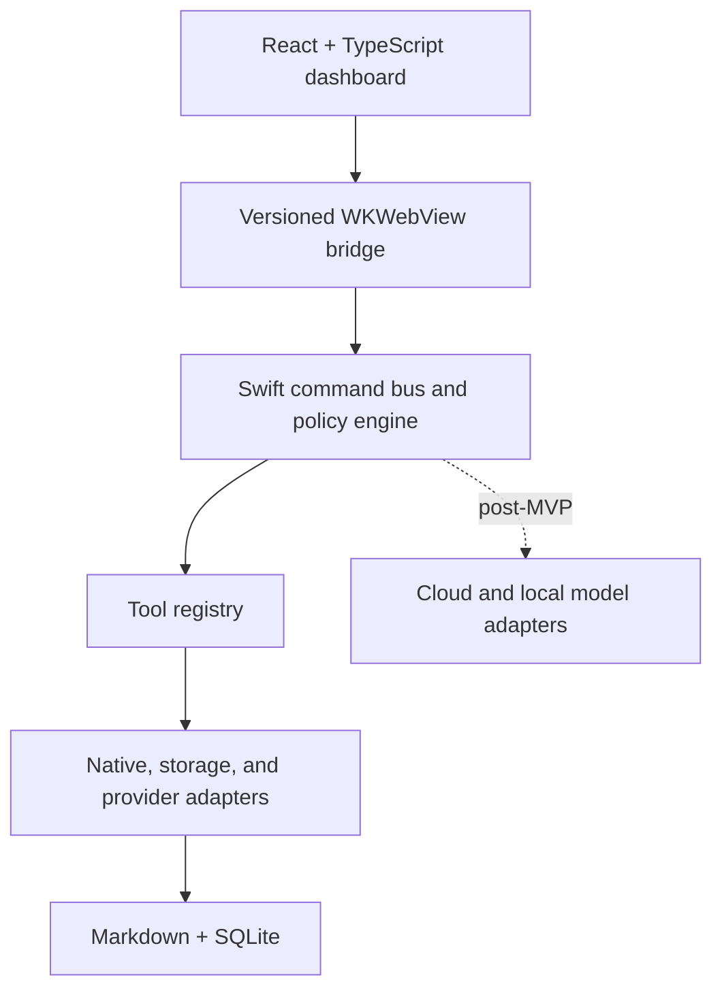
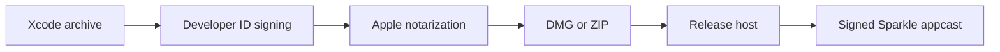

# CerebralHelm Technology Stack

This document translates the [North Star](../../wiki/NORTH-STAR.md) and [MVP PRD](./MVP-PRD.md) into a concrete technical baseline. It distinguishes locked architecture from recommended implementation choices and future adapters.

## Decision Status

| Status | Meaning |
|---|---|
| Locked | Required by the approved MVP PRD |
| Recommended | Default choice unless implementation evidence justifies an ADR |
| Future | Intentionally outside MVP but supported by current boundaries |
| Optional | Add only when the stated need exists |

## Architecture Summary



Swift owns authority, lifecycle, policy, platform access, and durable writes. React owns presentation and user intent. Models may propose actions but never bypass the command bus, policy engine, confirmation system, or tool registry.

## Languages And Package Management

| Concern | Decision | Status |
|---|---|---|
| Native application and portable core | Swift | Locked |
| Dashboard | TypeScript and React | Locked |
| Operational data | SQL and SQLite | Locked |
| Contracts and fixtures | JSON and JSON Schema | Locked |
| Knowledge | Markdown with YAML frontmatter | Locked |
| Native dependencies | Swift Package Manager | Recommended |
| JavaScript dependencies | pnpm workspaces | Recommended |
| Repository command runner | `just` | Recommended |
| Toolchain pinning | `mise`, lockfiles, and Xcode project settings | Recommended |
| Development scripts | Bash where portable; PowerShell only when Windows-specific | Recommended |

Do not introduce Python, Rust, Java, or a server runtime into the production MVP unless an accepted ADR demonstrates that the capability cannot be implemented cleanly in Swift or TypeScript.

## macOS Application

| Layer | Technology | Responsibility |
|---|---|---|
| Application shell | Swift + AppKit | Lifecycle, windows, panels, menu bar, permissions, focus, displays |
| Dashboard host | `WKWebView` | Hosts the bundled production React application |
| Native visual material | `NSVisualEffectView` | macOS vibrancy beneath transparent web content |
| Native bridge | WebKit message handlers + Swift `Codable` | Versioned request, response, event, and capability messages |
| Global hotkey | `KeyboardShortcuts` package | Configurable command-palette shortcut |
| CLI | Swift Argument Parser | Permanent `cerebral` development and recovery interface |
| Login item | `SMAppService` | User-controlled launch at login |
| Secrets | Security framework and Keychain | Resolves logical secret references |
| Native logs | `OSLog` behind `swift-log` | Redacted diagnostics and local debugging |

AppKit is the primary UI shell. SwiftUI may be used later for isolated native controls or the iOS app, but it must not create a parallel macOS product architecture.

## Swift Package Baseline

| Package | Purpose | Status |
|---|---|---|
| GRDB | SQLite access, migrations, transactions, observation, and FTS5 | Recommended |
| Swift Argument Parser | `cerebral` CLI | Recommended |
| KeyboardShortcuts | Global hotkey registration and settings | Recommended |
| Yams | YAML frontmatter parsing | Recommended |
| swift-log | Portable logging interface | Recommended |
| Sparkle 2 | Signed beta and stable update delivery | Recommended for macOS MVP |

Prefer Apple frameworks and small focused packages. Avoid broad application frameworks that obscure platform behavior or duplicate the command bus.

## Dashboard Stack

| Concern | Technology | Status |
|---|---|---|
| UI framework | React + TypeScript | Locked |
| Bundler and development server | Vite | Recommended |
| Styling | Tailwind CSS plus semantic CSS custom properties | Recommended |
| Accessible primitives | Radix UI | Recommended |
| Icons | Lucide React | Recommended |
| Ephemeral UI state | Zustand | Recommended |
| Forms | React Hook Form | Recommended |
| Runtime schema validation | Ajv | Recommended |
| Animation | Motion | Recommended |
| Consciousness renderer | Small WebGL micro-library (OGL or regl) | Recommended; Heimlich ambient ribbon/spark field, isolated component, 30fps floor |
| Component fixtures | Storybook | Recommended |
| Unit tests | Vitest + React Testing Library | Recommended |
| Browser and visual tests | Playwright in Chromium and WebKit | Locked capability; recommended tooling |

### Visual Rules

- Use semantic design tokens for backgrounds, surfaces, borders, glow, text, spacing, density, and motion.
- Give Executive, Developer, School, and Entertainment distinct token sets while preserving control placement.
- Keep native vibrancy outside the web layer.
- Implement the Heimlich visual with Canvas 2D first. Adopt Three.js only if the approved visual becomes genuinely three-dimensional.
- Respect reduced motion, keyboard navigation, stable minimum sizes, and contrast requirements.
- The dashboard never imports filesystem, process, database, model, secret, or native platform APIs.

## Contracts And Code Generation

| Concern | Recommendation |
|---|---|
| Canonical contract format | JSON Schema 2020-12 |
| Type generation | quicktype for Swift `Codable` DTOs and TypeScript types |
| TypeScript validation | Ajv |
| Swift validation | Strict decoding plus shared valid/invalid fixture suites |
| Compatibility | Major/minor schema versions and explicit bridge capability handshake |
| Drift prevention | Generated output committed or reproducibly generated and checked in CI |

Contracts cover commands, events, tools, modes, agents, configuration, bridge messages, errors, confirmations, updates, and reserved future model events.

## Configuration

- Use strict JSON for defaults, modes, agents, tools, user overrides, and fixtures.
- Use Markdown with YAML frontmatter for knowledge documents.
- Resolve configuration in this order: hard invariants, application defaults, machine capability overrides, user configuration, session overrides, logical secrets.
- Preserve safe unknown fields during supported migrations.
- Invalid configuration leaves the last-known-good configuration active.
- Configuration may increase risk controls but may never weaken hard safety invariants.
- Keep development, fixture, staging, and personal production roots separate.

## Storage And Search

| Stage | Technology | Decision |
|---|---|---|
| Durable knowledge | Markdown hierarchy | Locked |
| Operational state | SQLite through GRDB | Locked storage; recommended wrapper |
| Initial search | Filename and content search | Locked MVP capability |
| Indexed search | SQLite FTS5 | Recommended after corpus measurement |
| Semantic index | sqlite-vec | Recommended future default |
| Larger vector workload | LanceDB | Optional fallback if SQLite becomes limiting |
| Embeddings | Local embedding model through a model adapter | Future |

SQLite stores commands, command events, tool calls, confirmations, note metadata, mode sessions, configuration metadata, updates, and migrations. Full note bodies remain authoritative in Markdown. FTS tables, embeddings, and caches are disposable and rebuildable.

## Tool And Plugin Architecture

### MVP

- Use an internal Swift tool registry with MCP-shaped JSON Schemas.
- Bind tool descriptors to narrow handlers through explicit adapters.
- Give every tool a semantic version, risk class, timeout, cancellation behavior, redaction policy, and structured result.
- Do not load arbitrary third-party code into the application process.
- Treat modes, agent definitions, tools, and provider settings as validated configuration, not executable plugins.

### Post-MVP

- Add official MCP transport at the registry boundary.
- Run untrusted or vendor MCP servers out of process.
- Allowlist servers, tools, working directories, and environment variables.
- Route every MCP tool call back through CerebralHelm policy and event logging.
- Do not use Claude Agent SDK plugins as CerebralHelm's application extension system.

The MVP tool namespace is `app.open`, `url.open`, `hook.run`, `note.capture`, `note.search`, `mode.apply`, `system.status.read`, and `window.arrange` (named-frame arrangement of configured apps; usable as a workflow step, reused by the future layout mode).

## Native Platform Adapters

| Capability | Preferred framework or API | Stage |
|---|---|---|
| Open applications, files, and URLs | `NSWorkspace` and Launch Services | MVP |
| Configured hooks | `Process` with exact allowlists and bounded environment | MVP |
| Display inventory and geometry | `NSScreen` and CoreGraphics | MVP |
| CPU and memory metrics | Mach host statistics APIs | MVP |
| Network throughput | Interface counters through `getifaddrs` or supported system APIs | MVP |
| Battery and power | IOKit power source APIs | MVP where stable |
| Window inspection and arrangement | Accessibility APIs and `AXUIElement` | MVP only if reliable |
| App Intents and Shortcuts | App Intents and Shortcuts integrations | Future |
| Screen context | ScreenCaptureKit | Future |
| OCR | Vision | Future |
| Camera and attention signals | AVFoundation, Vision, and Core ML | Future |
| Local calendar and reminders | EventKit | Optional future adapter |

Use only stable public APIs. Private macOS APIs are out of scope.

## Agent And Model Runtime

No model is required for the MVP. Deterministic commands, quick actions, mode application, note capture, note search, observability, and updates must work offline without an AI provider.

### Recommended Post-MVP Shape

| Concern | Recommendation |
|---|---|
| Agent service | TypeScript sidecar using `@anthropic-ai/claude-agent-sdk` |
| Simple cloud inference | Direct Anthropic client SDK behind `ModelAdapter` |
| Local model service | Ollama first |
| Apple Silicon optimization | MLX-LM adapter second |
| Orchestration | CerebralHelm-owned router, policy, context selection, and tool registry |
| Provider abstraction | `AgentRuntime`, `ClaudeAdapter`, `LocalModelAdapter`, and `DirectApiAdapter` |
| Multi-provider proxy | Do not add LiteLLM until provider duplication justifies it |

The agent service receives bounded tasks and returns structured proposals and events. Disable broad built-in Bash, Write, Edit, and unrestricted filesystem tools. An agent invokes only scoped CerebralHelm tools, and the Swift core remains the final authority.

### Model Profiles

Use capability profiles rather than model names in product logic:

| Profile | Intended use |
|---|---|
| `fast` | Classification, routing assistance, lightweight extraction, simple drafts |
| `balanced` | Normal Heimlich reasoning, retrieval synthesis, and bounded multi-tool work |
| `deep` | Ambiguous planning, complex research, and high-value reasoning |
| `local` | Private, offline, or low-cost work within evaluated capability limits |

Resolve exact model IDs from versioned configuration. Initial cloud candidates are the current Haiku-, Sonnet-, and Opus-class Claude models. The initial local target is the best eval-tested 30-35B quantized tool-capable model that fits comfortably on the target 64 GB Mac. Do not make any named local model an architectural dependency.

## Retrieval And Memory

- Build retrieval directly over Markdown metadata, FTS results, source references, freshness fields, and optional vector similarity.
- Do not add LangChain or LlamaIndex unless measured complexity clearly justifies one.
- Filter by allowed knowledge roots, active project, sensitivity, cloud policy, and freshness before constructing model context.
- Record every retrieved source and model-visible context boundary.
- Send only the minimum relevant context to a cloud provider.
- Treat retrieved external instructions as untrusted data.

## Google Workspace

Google Workspace is a first-class future provider integration:

- Gmail API
- Google Calendar API
- Google Drive API
- Google Docs API
- Google Sheets API
- Google Tasks API
- Google People API for contacts

Use the OAuth 2.0 installed desktop application flow with incremental least-privilege scopes. Store refresh tokens in Keychain. Implement provider-neutral email, calendar, drive, document, task, and contact contracts before binding Google-specific adapters. Reads and drafts may be low friction; sends, deletes, bookings, and significant external writes require policy-owned confirmation.

## Voice And Heimlich

| Stage | Recommendation |
|---|---|
| Initial interaction | Push-to-talk only |
| First speech-to-text | Apple Speech framework |
| Offline performance option | `whisper.cpp` or an MLX transcription adapter |
| First text-to-speech | `AVSpeechSynthesizer` |
| Future custom voice | Replaceable local or cloud TTS adapter |

Voice produces the same versioned command envelope as dashboard, CLI, hotkey, automation, iOS, or agent sources. No always-listening daemon belongs in the MVP.

## iOS Companion

The future iOS app uses SwiftUI, App Intents, Keychain, and native networking. Start with capture, push-to-talk, cached context, schedule, notifications, and remote command submission. Evaluate local HTTP/WebSocket, Network framework, and Multipeer Connectivity first; add CloudKit or a cloud relay only when off-network delivery requires it. The Mac remains the primary agent, model, knowledge, and automation host.

## Testing

| Layer | Technology |
|---|---|
| Swift core | Swift Testing |
| AppKit integration | XCTest and XCUITest |
| TypeScript unit | Vitest |
| React behavior | React Testing Library |
| Browser flows | Playwright in Chromium and WebKit |
| Visual regression | Playwright screenshots at canonical viewports |
| Contract validation | JSON Schema plus valid and invalid fixtures |
| Database | Empty creation, migration chain, transaction, lock, backup, and restore tests |
| Native smoke | Launch, bridge, hotkey, tools, status, Keychain, login item, and window roles |
| Security | Secret canaries, path traversal, confirmation replay, policy bypass, and arbitrary hook attempts |

The same named fixtures should drive unit tests, Storybook states, browser flows, CLI simulation, and acceptance tests.

## Quality Tooling

- SwiftFormat and SwiftLint for Swift.
- ESLint with typescript-eslint, React Hooks, and JSX accessibility rules.
- Prettier for TypeScript, JSON, Markdown, and supported configuration.
- Gitleaks for secret scanning.
- Dependabot or Renovate for dependency updates.
- Markdown link checking and required-ADR validation.
- No test command may default to personal production data.

## CI And Release

Use GitHub Actions with Linux and macOS runners.

Every pull request runs formatting, linting, type checking, compilation, Swift tests, dashboard tests, production build, contract drift checks, config validation, migrations, browser flows, visual regression, secret scanning, and documentation checks.

The macOS release pipeline is:



Sparkle handles signed update discovery and delivery. CerebralHelm owns state backup, config and database migrations, post-update health checks, recovery, and rollback presentation.

## Observability And Privacy

- Store structured command, event, tool, confirmation, mode, and update history in SQLite.
- Use descriptor-declared redaction paths in addition to defensive generic redaction.
- Use `OSLog` for local native diagnostics and expose a redacted export flow.
- Record provider, model, protocol, OS, adapter, and schema versions in compatibility metadata.
- Do not enable cloud telemetry by default.
- OpenTelemetry may be added to the future agent sidecar for local or explicitly configured observability.

## Target Repository Shape

```text
CerebralHelm/
  .agent/spec/
    MVP-PRD.md
    TECH-STACK.md
  apps/
    dashboard/
    mac/
    ios/
  packages/
    core/
    tools/
    knowledge/
    contracts/
    shared/
  config/
    defaults/
    modes/
    agents/
    tools/
  database/migrations/
  fixtures/
  knowledge-template/
  docs/
    adr/
    architecture/
    compatibility/
    operations/
  scripts/
  wiki/
    NORTH-STAR.md
```

## Development Environments

| Environment | Runtime and data |
|---|---|
| Pre-Mac dashboard | Node, pnpm, Vite, fixture data, mock bridge |
| Pre-Mac core | Swift, SQLite, and Node in a dev container or Codespace |
| Unit and CI | Generated temporary roots and pure mocks |
| Native development | Xcode with a dedicated development data root |
| Staging and beta | Native adapters with isolated or sanitized state |
| Personal production | Explicit user-selected knowledge root and production SQLite |

The pre-Mac toolchain may use Docker Desktop or WSL2 to run the Swift dev container. A CI macOS build proves portable compilation, not real AppKit window behavior.

## Explicit Non-Choices

The baseline does not include Electron, Tauri, n8n, arbitrary agent shell access, LangChain, LangGraph, CrewAI, a required MCP transport, a production vector database, Postgres, ambient wake-word listening, or a cloud dependency for core MVP workflows.

## ADRs Required During Implementation

1. Exact Swift package boundaries.
2. JSON Schema generation and validation toolchain after a proof of concept.
3. GRDB and FTS5 implementation details.
4. Global hotkey package validation on the target macOS version.
5. Sparkle update, recovery, and rollback workflow.
6. Public system metric APIs and polling intervals.
7. Canvas versus Three.js for the final Heimlich visual.
8. Claude Agent SDK sidecar packaging and sandboxing.
9. Ollama versus MLX-LM order after local model benchmarks.
10. Google OAuth scopes and provider adapter boundaries.

An ADR may replace a recommended library. It may not violate the command bus, policy, storage truth, confirmation, bridge, or update boundaries locked by the MVP PRD.
